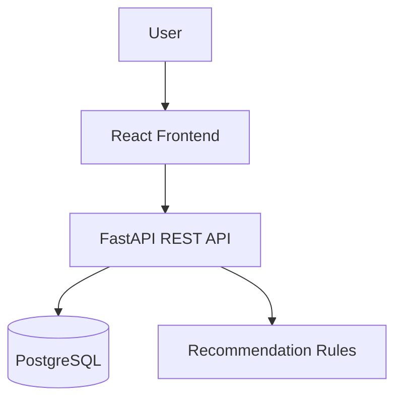

# FitPulse (APMHOS)

FitPulse is a full-stack fitness tracking app with:

- a FastAPI backend for auth, onboarding, daily logs, and recommendations
- a React + Vite frontend for dashboarding, activity capture, schedule, and insights
- a PostgreSQL database for users and logs

The app personalizes workout recommendations based on user goal and reported energy level.

## What the app does

- Sign up and log in with JWT-based auth
- Complete onboarding (age, gender, level, goal, height, weight, target weight)
- Log daily steps, workouts, mood, energy, and weight
- View 7-day visual insights (steps, calories, mood vs energy, weight trend)
- Get an adaptive recommendation on the schedule tab

## Tech stack

- Frontend: React 19, TypeScript, Vite, Recharts
- Backend: FastAPI, SQLAlchemy, psycopg2, python-jose, bcrypt
- Database: PostgreSQL

## Repository layout

```text
health/
  backend/
    app/
      api/v1/           # FastAPI route modules
      core/             # DB and security config
      models/           # SQLAlchemy models
      schemas/          # Pydantic schemas
      services/         # Recommendation service layer
      utils/            # Recommendation rule logic
      main.py           # FastAPI app entrypoint
  fitpulse/
    src/
      components/       # UI views/widgets
      api.ts            # Frontend API client
      App.tsx           # App shell + auth/session orchestration
```

## Architecture (high level)



## Quick start

Run the commands below from your cloned repository root (the folder containing `backend/` and `fitpulse/`).

### 1) Prerequisites

- Python 3.10+
- Node.js 18+
- PostgreSQL running locally on port 5432

### 2) Backend setup

> Important: DB credentials are currently hardcoded in `backend/app/core/database.py`.

By default, backend expects:

- database: `fitpulse`
- user: `unocade`
- password: `secret`
- host: `localhost:5432`

If your local setup differs, edit `backend/app/core/database.py` first.

```bash
cd backend
python -m venv venv
source venv/bin/activate
pip install fastapi uvicorn sqlalchemy psycopg2-binary python-jose bcrypt
uvicorn app.main:app --host 0.0.0.0 --port 8000 --reload
```

When the backend starts, `init_db()` attempts to:

1. create the `fitpulse` DB if missing
2. create tables from SQLAlchemy models

### 3) Frontend setup

```bash
cd fitpulse
npm install
npm run dev
```

Vite runs on `http://localhost:5173` by default.

Useful frontend scripts:

```bash
cd fitpulse
npm run build
npm run preview
npm run lint
```

Frontend API base is currently hardcoded in `fitpulse/src/api.ts` as:

- `BASE = "http://localhost:8000"`

If backend runs elsewhere, update that constant.

## API map (current behavior)

Base URL: `http://localhost:8000`

### Authentication

- `POST /auth/signup` -> register user and return token
- `POST /auth/login` -> authenticate and return token
- `GET /auth/me` -> return current user from `Authorization: Bearer <token>`

### User onboarding

- `POST /users/{user_id}/onboard` -> save profile metrics and mark user onboarded
- `GET /users/{user_id}` -> get user profile

### Logs

- `POST /logs/` -> create or update daily log
  - supports `is_delta` for step add vs replace behavior
  - if `weight` is included, syncs to user profile weight
- `GET /logs/{user_id}` -> returns up to 7 logs in ascending date order

### Recommendation

- `GET /recommendations/{user_id}` -> generate recommendation from goal + latest log energy

## Data model snapshot

### `users`

- `id`, `name`, `email`, `hashed_password`, `is_onboarded`
- `age`, `gender`, `fitness_level`, `goal`
- `height`, `weight`, `target_weight`

### `daily_logs`

- `id`, `user_id`, `date`
- `steps`, `workout_done`, `workout_type`, `workout_duration`
- `energy_level`, `mood`, `weight`

## Frontend flow

1. User signs up/logs in (`fitpulse/src/components/Login.tsx`, `fitpulse/src/components/Signup.tsx`)
2. Token is stored in local storage (`apmhos_token`)
3. User profile cache is stored in local storage (`apmhos_user`)
4. Onboarding completes profile if `is_onboarded` is false
5. Tabs provide:
   - `Dashboard`: daily snapshot + quick edits
   - `Activity Log`: save steps/workout/weight
   - `Schedule`: weekly plan + recommendation call
   - `Insights`: charts from recent logs

## Known limitations / cleanup opportunities

- Security/config values are hardcoded (`DATABASE_URL`, JWT `SECRET_KEY`)
- No `requirements.txt` for backend dependency pinning
- Recommendation API returns computed response only (recommendations table is not persisted)
- `/logs/{user_id}` currently returns first 7 ascending rows after query ordering, which may not always be the latest 7 logs
- `fitpulse/src/api.ts` still contains deprecated `createUser()` helper not used by current backend routes

## Troubleshooting

### Backend cannot connect to PostgreSQL

If startup fails with `psycopg2.OperationalError`, verify:

- PostgreSQL service is running
- credentials/host in `backend/app/core/database.py` are correct
- local firewall allows `5432`

### Frontend CORS errors

Backend CORS currently allows:

- `http://localhost:5173`
- `http://127.0.0.1:5173`

If your frontend host/port differs, update `backend/app/main.py`.

## Demo-ready test flow

1. Create account in UI
2. Complete onboarding
3. Log steps + one workout + weight update
4. Open Schedule tab and show recommendation
5. Open Insights tab to show trend charts

For a presentation script, see `presentation.md`.
