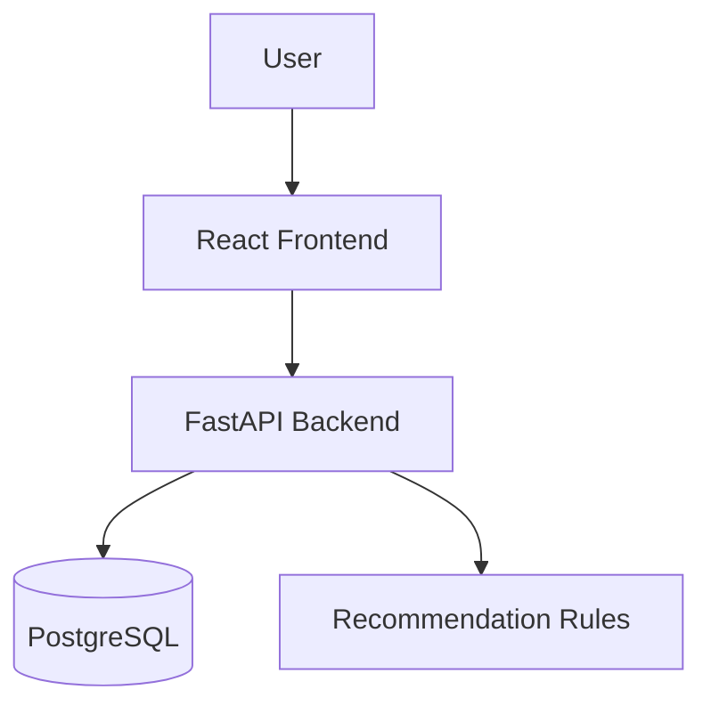

# FitPulse Presentation Guide

Use this as a practical script for a 7-12 minute app walkthrough.

## 1) Opening (30-45 seconds)

**Talk track:**

"FitPulse helps users make better daily fitness decisions by combining tracked behavior (steps, workouts, mood, energy, weight) with adaptive workout recommendations. It is a full-stack app with a FastAPI backend, PostgreSQL storage, and a React frontend."

## 2) Problem -> Solution (1 minute)

- **Problem:** Many fitness apps are either generic or hard to sustain daily.
- **Gap:** Users need quick, actionable guidance based on how they feel today.
- **Solution:** FitPulse captures day-to-day context and responds with tailored recommendations.

## 3) Product demo flow (4-6 minutes)

### Step A: Authentication

- Show signup and login screens.
- Mention JWT-based auth and secure route calls using Bearer token.

### Step B: Onboarding

- Walk through profile setup: age, gender, level, goal, height, weight.
- Mention target-weight validation for weight-loss users.

### Step C: Dashboard and logging

- Show dashboard summary (steps, calories, mood, workout status).
- Update steps and mood in real time.
- Open Activity Log and save:
  - additional steps
  - one workout entry
  - one weight update

### Step D: Schedule + recommendation

- Open schedule tab.
- Show static weekly plan for the selected goal.
- Highlight AI recommendation block (workout type, duration, intensity, tip, step goal).

### Step E: Insights

- Open insights tab and show trends:
  - steps over time
  - mood vs energy
  - calories trend
  - weight trend and BMI bands (if weight data exists)

## 4) Technical architecture slide (1-2 minutes)

Use this diagram:

Talking points:

- Frontend calls backend REST endpoints from `fitpulse/src/api.ts`.
- Backend routers split by domain: auth, users, logs, recommendations.
- Recommendation logic is centralized in `backend/app/utils/rules.py`.
- Daily logs power both recommendations and visual analytics.

## 5) What is unique (45-60 seconds)

- Adaptive recommendation based on user goal + energy state
- Unified logging flow (movement, workout, mood, and weight)
- Insight visuals that make progress understandable at a glance
- Clean mobile-first UI suitable for rapid daily use

## 6) Current limitations (honest engineering note)

- DB and JWT settings are still hardcoded in backend config
- No backend dependency lock file yet (`requirements.txt` missing)
- Recommendation records are generated on request and not persisted
- Log query behavior can be improved to guarantee latest 7 days

## 7) Roadmap slide (45-60 seconds)

- Move secrets/config to environment variables
- Add stronger auth/session hardening and validation
- Persist recommendations and add history/explanations
- Add wearable integrations (Apple Health / Google Fit)
- Add weekly adherence scoring and coach-style nudges

## 8) Closing (20-30 seconds)

"FitPulse turns daily health signals into actionable guidance. The current version already demonstrates a complete full-stack loop: secure onboarding, persistent tracking, adaptive recommendations, and visual feedback. Next steps focus on production hardening and deeper personalization."

## Optional Q&A prep

- **How are recommendations generated?**
  - Rule-based logic combines goal + energy + BMI-derived step targeting.
- **How fast is onboarding to value?**
  - A user can sign up, onboard, and get first recommendation in under 2 minutes.
- **How do you scale this?**
  - Add env-based config, migration tooling, and containerized deployment pipeline.

